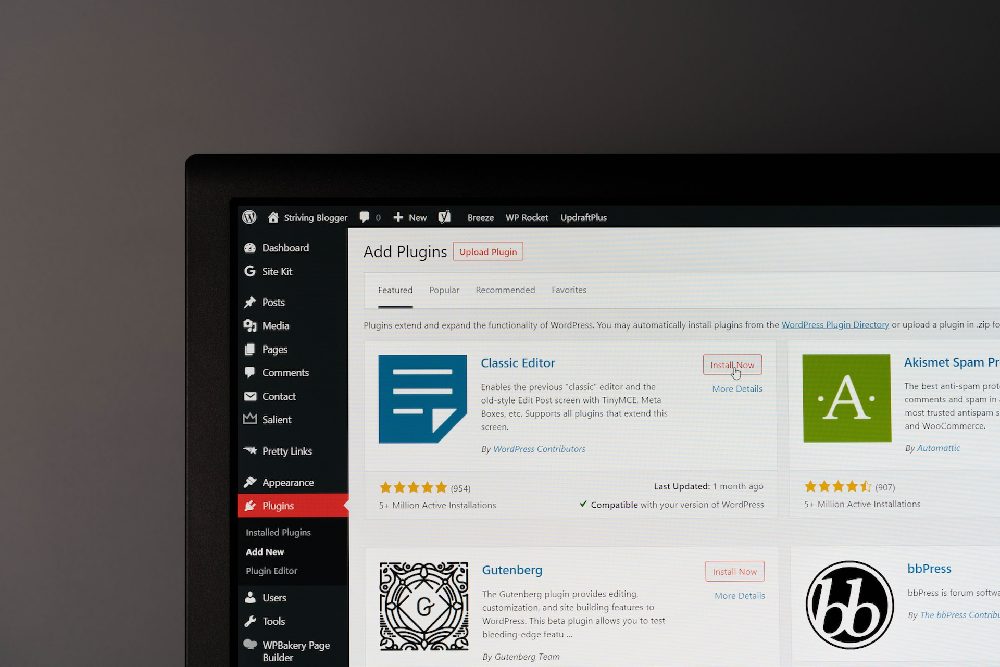

# Project Title

Brief one or two sentence summary of your project.

## Table of Contents
1. [Introduction](#introduction)
2. [Getting Started](#getting-started)
3. [Usage](#usage)
4. [Contributing](#contributing)
5. [License](#license)

## Introduction

Detailed overview of the project, its purpose, and any major features. This is your opportunity to introduce your project and entice users to dig deeper.

## Getting Started

### Prerequisites
List any prerequisites to installing and running your project. This may include specific software or hardware requirements.

### Installation
Provide detailed instructions on how to clone your repository and set up the project on local machines. This should include any necessary installation commands.

## Usage
Offer some examples of how to use your project. This may involve providing example commands, screenshots, or explaining the use of specific features.

## Contributing
Guide other developers on how to contribute to your project. You can also link to a separate `CONTRIBUTING.md` file.

### Issue/Bug Reports:
If you are having an issue with the existing project code, please submit a bug report under the following guidelines:
- Check first to see if your issue has already been reported.
- Check to see if the issue has recently been fixed by attempting to reproduce the issue using the latest master branch in the repository.
- Create a live example of the problem.
- Submit a detailed bug report including your environment & browser, steps to reproduce the issue, actual and expected outcomes, where you believe the issue is originating from, and any potential solutions you have considered.

### Feature Requests
We would love to hear from you about new features which would improve this app and further the aims of our project. Please provide as much detail and information as possible to show us why you think your new feature should be implemented.

### Pull Requests
If you have developed a patch, bug fix, or new feature that would improve this app, please submit a pull request. It is best to communicate your ideas with the developers first before investing a great deal of time into a pull request to ensure that it will mesh smoothly with the project.

Remember that this project is licensed under the MIT license, and by submitting a pull request, you agree that your work will be, too.

## License

Information about the software's licensing. This is typically where you'd include the full text of the license, or for longer licenses (like the GNU GPL), instructions on where to find the license.

